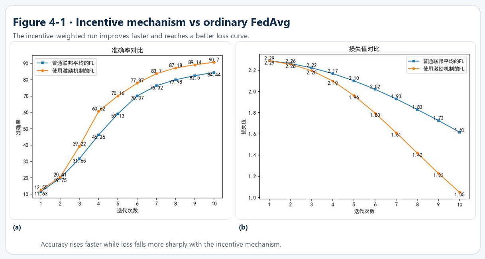
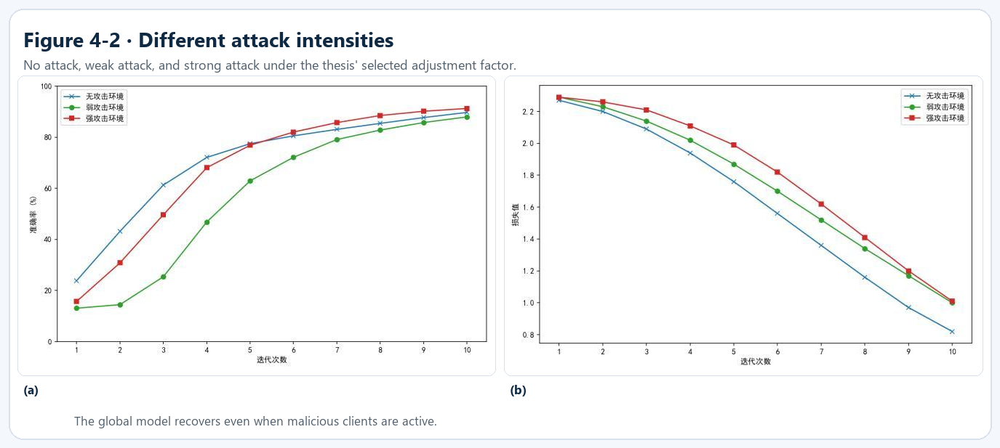
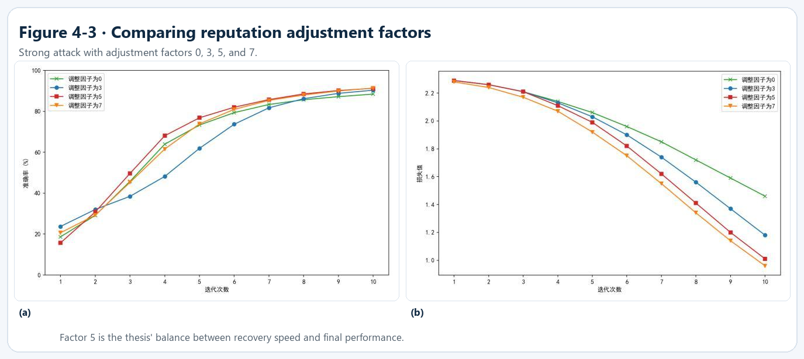
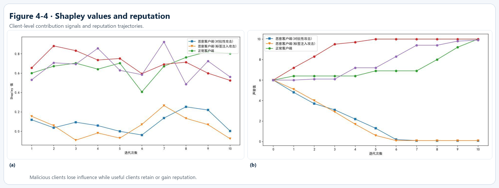
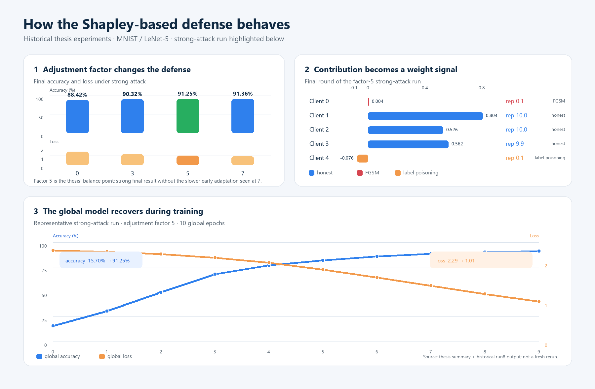

# HIT-Bachelor-Thesis-Federated-Learning

这是我的本科毕业设计代码和论文公开版，研究主题是：**基于激励机制的联邦学习恶意参与者防御方法**。

项目从一个比较朴素的 MNIST 联邦学习系统开始，逐步加入客户端信誉、标签注入攻击、FGSM 对抗样本攻击，最后把 Shapley 值引入到信誉更新和模型聚合中。代码目录里保留的是最后一版实现，论文和几组实验结果则帮助说明这套机制为什么这样设计、实际跑出了什么现象。

> 这是毕业设计阶段的历史研究与工程记录，不是现成的作业答案，也不保证在今天的深度学习环境中无需调整即可复现论文中的全部数字。论文公开版保留了实验论证和结果，原始提交材料中的个人信息没有随仓库发布。

## Overview

联邦学习的基本想法是：数据留在客户端，本地训练只上传模型更新，服务器再把这些更新聚合成新的全局模型。这样做可以避免把原始数据集中到服务器，但它也带来一个现实问题——服务器收到的客户端更新并不一定都值得同样信任。

本项目模拟了两类恶意客户端：

- 使用 FGSM 修改输入样本，使本地模型在对抗样本上训练；
- 以一定概率随机修改训练标签，模拟标签注入/数据投毒。

最终版本没有简单地把每个客户端的更新等权相加，而是根据客户端在当前轮次中的边际贡献计算 Shapley 值，再按照贡献分布调整信誉。信誉较高的更新在聚合时占更大的权重，贡献明显偏低的客户端则会被逐渐降低影响力。

这个项目最有意思的地方不在于把一个 LeNet 跑起来，而在于把“一个客户端到底帮了多少忙”变成了可以参与聚合的数值。它也暴露了一个很实际的取舍：精确 Shapley 值需要遍历客户端子集，客户端数量一多，计算成本会很快上升。

## What is implemented

### 1. 基础联邦学习

- 使用 LeNet-5 处理 MNIST；
- 将训练集按客户端编号划分为互不重叠的子集；
- 客户端执行本地 SGD 训练并返回参数差值；
- 服务端进行全局模型评估和多轮聚合；
- 通过配置文件控制客户端数量、局部迭代轮数、全局迭代轮数和聚合步长。

### 2. 恶意参与者模拟

`client_new.py` 中的 `attack_type` 有三种状态：`none`、`fgsm` 和 `label_poisoning`。

- `fgsm` 使用 `torchattacks.FGSM` 生成对抗样本；
- `label_poisoning` 按 `attack_probability` 随机把标签替换成其他类别；
- `main_new.py` 根据配置随机分配恶意客户端数量，并打印本轮攻击客户端编号。

### 3. Shapley 贡献评估

`server_new.py` 会对参与当前轮次的客户端组合进行评估。对于某个客户端，系统比较“包含它的子集”和“不包含它的子集”在评估集上的性能差异，并把所有子集的边际贡献加权汇总为 Shapley 值。

实现里使用了以客户端编号元组为键的 memo 字典，避免重复评估完全相同的客户端子集。这个优化对五客户端的小规模实验很有用，但它并没有改变 Shapley 计算本身的指数级增长特征。

### 4. 信誉更新与加权聚合

每个客户端初始信誉为 `6.0`，范围限制在 `0.1` 到 `10`。系统计算 Shapley 值的 33% 和 66% 分位数：

- 高于高分位数的客户端获得正向调整；
- 低于低分位数的客户端获得负向调整；
- 中间区域的客户端暂时保持不变。

调整幅度经过 Sigmoid 函数平滑，再乘以 `adjustment_factor`。之后，`model_aggregate()` 按当前信誉在参与客户端信誉总和中的比例，对本地更新进行加权。

## Project structure

```text
code/
├── data/
│   └── README.md
└── ver8_shapley_fgsm_adver/
    ├── main_new.py       # 训练入口、攻击客户端分配和实验循环
    ├── server_new.py     # 模型聚合、评估、Shapley 和信誉更新
    ├── client_new.py     # 本地训练、FGSM 和标签注入
    ├── datasets.py       # MNIST 数据加载与预处理
    ├── models.py         # 模型工厂
    ├── LeNet.py          # LeNet-5 网络结构
    └── conf.json         # 最终实验配置
docs/
├── figures/              # 从历史实验结果中挑选的曲线图
├── results/              # 论文中的关键结果摘要
└── thesis-public.pdf    # 去除身份封面的论文公开版
```

## Configuration used by the final implementation

`code/ver8_shapley_fgsm_adver/conf.json` 的关键设置如下：

| 参数 | 值 | 作用 |
| --- | ---: | --- |
| `model_name` | `lenet5` | 使用 LeNet-5 |
| `type` | `mnist` | 数据集类型 |
| `no_models` | `5` | 客户端总数 |
| `k` | `5` | 每轮参与聚合的客户端数 |
| `global_epochs` | `10` | 全局训练轮数 |
| `local_epochs` | `3` | 每个客户端的本地训练轮数 |
| `num_fgsm_attack_clients` | `1` | FGSM 客户端数量 |
| `num_label_poisoning_clients` | `1` | 标签注入客户端数量 |
| `attack_probability` | `1` | 标签注入概率 |
| `adversarial_epsilon` | `1` | FGSM 扰动参数 |
| `adjustment_factor` | `5` | Shapley 信誉调整因子 |

论文第三章的基础联邦学习实验使用过另一组配置，例如十个客户端、每轮选五个客户端、全局迭代二十轮；第四章的最终攻击实验则使用五个客户端和不同的调整因子。README 和结果说明会把这两部分分开，避免把不同实验的数字混在一起。

## Installation

建议使用 Python 3.9 或更新版本，并准备一个单独的虚拟环境。依赖主要包括 PyTorch、Torchvision、Torchattacks、NumPy 和 Matplotlib。

```bash
python -m venv .venv

# Linux/macOS
source .venv/bin/activate

# Windows PowerShell
.venv\Scripts\Activate.ps1

pip install -r requirements.txt
```

如果需要使用 GPU，请按照本机 CUDA 版本安装对应的 PyTorch，而不是机械地直接复制某个旧环境的 wheel。

## Data preparation

代码默认从 `code/ver8_shapley_fgsm_adver` 运行，并把数据路径写成 `../data/`。第一次运行时，`torchvision` 会尝试下载 MNIST；也可以先按照 [`code/data/README.md`](code/data/README.md) 准备本地数据。

原始 MNIST 数据和 CIFAR-10 压缩包没有上传。它们属于运行输入，不是这项研究真正想展示的实现内容，也会让仓库变得很重。

## Running the final experiment

```bash
cd code/ver8_shapley_fgsm_adver
python main_new.py --conf conf.json
```

程序会依次：

1. 创建五个客户端并随机分配正常、FGSM、标签注入三类行为；
2. 选择一个正常客户端做预训练参考；
3. 执行十轮全局训练；
4. 对每轮参与的客户端计算 Shapley 值；
5. 更新信誉并用信誉比例聚合模型更新；
6. 打印全局准确率、损失、客户端局部评估、Shapley 值和信誉值。

Shapley 计算会重复训练和评估多个客户端子集，因此运行速度明显慢于普通 FedAvg。客户端数量不适合随意增大。

## Results from the thesis experiments

论文在强攻击环境下比较了四个信誉调整因子。下面的数字来自论文中的历史实验记录，不是我在当前环境里重新跑出的结果：

| 调整因子 | 初始准确率 | 最终准确率 | 最终损失 |
| ---: | ---: | ---: | ---: |
| `0` | 18.66% | 88.42% | 1.46 |
| `3` | 23.72% | 90.32% | 1.18 |
| `5` | 15.70% | 91.25% | 1.01 |
| `7` | 20.63% | 91.36% | 0.96 |

论文最后选择调整因子 `5` 作为更均衡的设置：因子 `7` 的最终数字略高，但因子 `5` 在训练前期下降更快，整体适应速度更好。

## Thesis figures

论文第四章的四组核心结果图已经单独整理出来。它们不是装饰图，而是分别对应“激励机制是否有效”“攻击强度变化时是否能恢复”“调整因子怎么选”和“Shapley/信誉是否真的区分了客户端”这四个问题。

### Figure 4-1 · Incentive mechanism vs ordinary FedAvg



使用信誉激励的 FL 在准确率上升速度和损失下降速度上都优于普通联邦平均，说明信誉加权不是只改变了一个统计量，而是实际影响了训练过程。

### Figure 4-2 · Different attack intensities



在无攻击、弱攻击和强攻击三种环境下，模型都能继续恢复；强攻击下前期更困难，但后期仍然接近较高的准确率。

### Figure 4-3 · Reputation adjustment factor



调整因子为 `5` 的曲线在恢复速度和最终效果之间最均衡，这也是论文最终采用它作为代表设置的原因。

### Figure 4-4 · Shapley values and reputation



这组图最直接地展示了方法的核心：恶意客户端的 Shapley 值长期偏低，信誉随训练下降；正常客户端则保持较高贡献和信誉，因此在后续聚合中拥有更大的权重。

## Experiment overview

论文中的原始曲线适合放在实验记录里，但单独看不太容易理解方法到底做了什么。因此这里用一张总览图把三个关键观察放在一起：



- 左上：在强攻击条件下，信誉调整因子从 `0`、`3`、`5` 到 `7` 时的最终准确率和损失。论文选择 `5`，是因为它在最终效果和前期恢复速度之间更均衡。
- 右上：一次调整因子为 `5` 的运行在最后一轮的客户端状态。正常客户端的 Shapley 值和信誉较高，FGSM 与标签注入客户端的贡献/信誉被压低，因而在下一轮聚合中影响更小。
- 下方：同一次强攻击运行的全局准确率和损失变化。模型从较低的初始准确率逐步恢复，最后达到论文记录的 `91.25%`。

图中数据来自论文结果摘要和历史 `run8` 输出，不是上传时重新训练得到的新基准。

## Reading the implementation together with the thesis

建议先看 `main_new.py`，了解一次训练循环的顺序；然后看 `client_new.py` 的攻击分支；最后阅读 `server_new.py` 的三个部分：信誉加权聚合、Shapley 子集评估、基于分位数的信誉更新。

论文公开版放在 `docs/thesis-public.pdf`。它保留了系统模型、攻击设置、Shapley 定义、缓存优化、信誉调整策略和实验分析，但第一页换成了不包含个人身份字段的公开封面。论文正文里的公式和结果仍然是这组代码整理时最重要的参考。

## Known limitations

- 这是小规模研究原型，不是生产级联邦学习框架。
- Shapley 值的精确计算随客户端数量指数增长；当前配置适合演示和论文实验，不适合直接扩展到大规模联邦系统。
- 论文中的预训练环节在最终代码里主要作为运行参考输出，最终信誉更新采用 Shapley 分位数机制；早期固定准确率阈值方案已经不再是主路径。
- 论文第三章基线实验与第四章攻击实验使用的配置不同，不能用一个 `conf.json` 复现论文中的全部图表。
- 未上传模型 checkpoint、原始数据、旧版环境和完整运行日志；历史日志包含本机路径，而且不是复现核心所必需的材料。
- 代码依赖较旧的 PyTorch/Torchvision 接口，现代环境可能需要调整数据下载或 CUDA 配置。

## License and academic context

本仓库没有新增项目级 License。代码和论文是本科毕业设计阶段的个人研究记录；其中使用的 PyTorch、Torchvision、Torchattacks、NumPy 和 Matplotlib 仍受各自上游许可约束，详见 [`THIRD_PARTY_NOTICES.md`](THIRD_PARTY_NOTICES.md)。

论文和实验结果仅用于展示研究思路、实现过程和历史学习记录，不应直接作为其他课程或毕业设计的提交材料。
